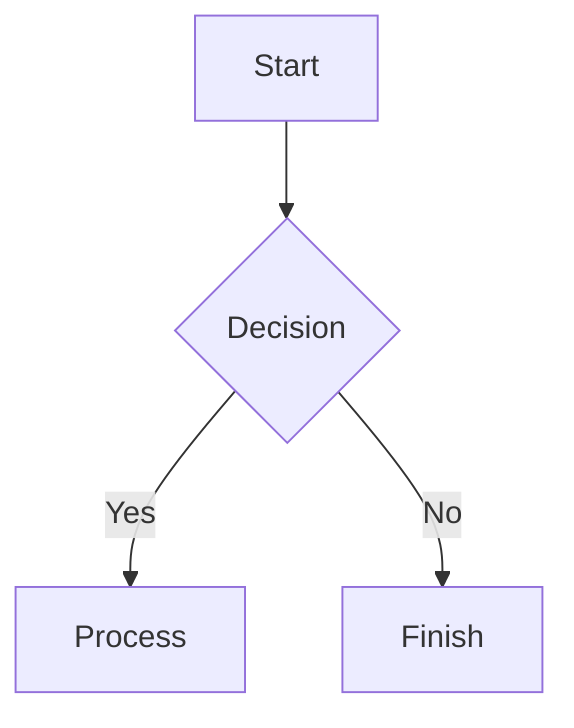
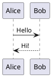

# feishu_create_doc

Use `feishu_create_doc` to create a Feishu cloud document from Lark-flavored Markdown.

# Return Value

On success, the tool returns a JSON object with these fields:

- **`doc_id`** (`string`): The document token, such as `doxcnXXXXXXXXXXXXXXXXXXX`
- **`doc_url`** (`string`): A browser-accessible document URL, such as `https://www.feishu.cn/docx/doxcnXXXXXXXXXXXXXXXXXXX`
- **`message`** (`string`): A result message, such as `Document created successfully`

# Parameters

## `markdown` (required)

The document body in Lark-flavored Markdown.

Produce content that is well structured, visually varied, and easy to read. Use callouts, grids, and tables when they improve comprehension. Use images and Mermaid diagrams when visuals explain the material more effectively.

Follow these principles:

- **Clear structure**: Use no more than four heading levels and use callouts for important information.
- **Visual rhythm**: Break up long passages with horizontal rules, grids, and tables.
- **Integrated visuals**: Prefer Mermaid or PlantUML for flows and architecture.
- **Restraint**: Do not overuse callouts, and reserve bold text for genuinely important points.

If the user specifies a style or visual direction, follow the user's requirements.

Important rules:

- **Do not duplicate the title**: Do not begin `markdown` with an H1 that repeats `title`. The `title` parameter already sets the document title, so begin with the body.
- **Do not add a manual table of contents**: Feishu generates it automatically.
- Follow the Lark-flavored Markdown syntax in the Content Format section below.
- For a long document, strongly prefer creating an initial section and then adding subsequent sections with `update-doc` in `append` mode. This improves reliability.

## `title` (optional)

The document title.

## `folder_token` (optional)

The parent folder token. If omitted, the document is created in the root of the user's personal space.

Extract the token from a folder URL such as `https://xxx.feishu.cn/drive/folder/fldcnXXXX`; in this example, `fldcnXXXX` is the `folder_token`.

## `wiki_node` (optional)

A wiki node token or URL. When supplied, the document is created under that node. It is mutually exclusive with `folder_token` and `wiki_space`.

Extract the token from a wiki URL such as `https://xxx.feishu.cn/wiki/wikcnXXXX`; in this example, `wikcnXXXX` is the `wiki_node` token.

## `wiki_space` (optional)

A wiki space ID. When supplied, the document is created at the root of that space. The special value `my_library` selects the user's personal wiki. It is mutually exclusive with `wiki_node` and `folder_token`.

Extract the ID from a wiki settings URL such as `https://xxx.feishu.cn/wiki/settings/7448000000000009300`; in this example, `7448000000000009300` is the `wiki_space` ID.

**Location precedence**: `wiki_node` > `wiki_space` > `folder_token`

# Examples

## Example 1: Create a simple document

```json
{
  "title": "Project plan",
  "markdown": "## Project overview\n\nThis is a new project.\n\n## Goals\n\n- Goal 1\n- Goal 2"
}
```

## Example 2: Create a document in a folder

```json
{
  "title": "Meeting notes",
  "folder_token": "fldcnXXXXXXXXXXXXXXXXXXXXXX",
  "markdown": "## Weekly meeting — 2025-01-15\n\n### Topics\n\n1. Project status\n2. Next week's plan"
}
```

## Example 3: Use Feishu extensions

This example uses a callout and an enhanced table.

```json
{
  "title": "Product requirements",
  "markdown": "<callout emoji=\"💡\" background-color=\"light-blue\">\nImportant requirement\n</callout>\n\n## Features\n\n<lark-table header-row=\"true\">\n<lark-tr>\n<lark-td>\n\n**Feature**\n\n</lark-td>\n<lark-td>\n\n**Priority**\n\n</lark-td>\n</lark-tr>\n<lark-tr>\n<lark-td>\n\nSign in\n\n</lark-td>\n<lark-td>\n\nP0\n\n</lark-td>\n</lark-tr>\n</lark-table>"
}
```

## Example 4: Create a document under a wiki node

```json
{
  "title": "Technical documentation",
  "wiki_node": "wikcnXXXXXXXXXXXXXXXXXXXXXX",
  "markdown": "## API reference\n\nThis document belongs to a wiki."
}
```

## Example 5: Create a document at a wiki-space root

```json
{
  "title": "Project overview",
  "wiki_space": "7448000000000009300",
  "markdown": "## Overview\n\nThis is a top-level document in the wiki space."
}
```

## Example 6: Create a document in the user's personal wiki

```json
{
  "title": "Study notes",
  "wiki_space": "my_library",
  "markdown": "## Notes\n\nThis document is in the user's personal wiki."
}
```

# Content Format

The document body uses **Lark-flavored Markdown**, an extension of standard Markdown that supports Feishu document blocks and rich-text formatting.

## General Rules

- Use standard Markdown as the foundation.
- Use the custom XML tags documented below for Feishu-specific features.
- Escape literal special characters with a backslash when necessary: `*`, `~`, `` ` ``, `$`, `[`, `]`, `<`, `>`, `{`, `}`, `|`, and `^`.

---

## Basic Block Types

### Text and paragraphs

```markdown
A plain text paragraph.

A paragraph with **bold text**.

Separate paragraphs with a blank line.

Centered text {align="center"}
Right-aligned text {align="right"}
```

Paragraph alignment supports `{align="left|center|right"}`. It can be combined with color, for example `{color="blue" align="center"}`.

### Headings

Feishu supports nine heading levels. Use standard Markdown for H1-H6 and HTML tags for H7-H9.

```markdown
# Heading level 1
## Heading level 2
### Heading level 3
#### Heading level 4
##### Heading level 5
###### Heading level 6
<h7>Heading level 7</h7>
<h8>Heading level 8</h8>
<h9>Heading level 9</h9>

# Colored heading {color="blue"}
## Red heading {color="red"}
# Centered heading {align="center"}
## Centered blue heading {color="blue" align="center"}
```

Heading attributes support `{color="COLOR"}` and `{align="left|center|right"}`, separately or together. Valid colors are `red`, `orange`, `yellow`, `green`, `blue`, `purple`, and `gray`. Use them sparingly.

### Lists

Indent nested ordered and unordered lists with a tab or two spaces.

```markdown
- Unordered item 1
  - Unordered item 1.a
  - Unordered item 1.b

1. Ordered item 1
2. Ordered item 2

- [ ] To do
- [x] Complete
```

### Blockquotes

```markdown
> This quotation
> spans multiple lines.

> Quotes support **bold** and *italic* formatting.
```

### Code blocks

Only fenced code blocks with triple backticks are supported. Indented code blocks are not supported.

````markdown
```python
print("Hello")
```
````

Common language identifiers include `python`, `javascript`, `go`, `java`, `sql`, `json`, `yaml`, and `shell`.

### Horizontal rules

```markdown
---
```

---

## Rich-Text Formatting

### Text styles

`**bold**` `*italic*` `~~strikethrough~~` `` `inline code` `` `<u>underline</u>`

### Text color

`<text color="red">Red text</text>` `<text background-color="yellow">Yellow background</text>`

Supported colors are `red`, `orange`, `yellow`, `green`, `blue`, `purple`, and `gray`.

### Links

`[Link text](https://example.com)`

Anchor links are not supported.

### Inline equations

Use `$E = mc^2$` with spaces outside the dollar signs, or use `<equation>E = mc^2</equation>`, which has no surrounding-space restriction and is preferred.

---

## Advanced Block Types

### Callouts

```html
<callout emoji="✅" background-color="light-green" border-color="green">
Content can use **formatting** and can contain multiple supported blocks.
</callout>
```

Attributes:

- `emoji`: An emoji character such as ✅, ⚠️, or 💡
- `background-color`
- `border-color`
- `text-color`

Background colors include `light-red`, `red`, `light-blue`, `blue`, `light-green`, `green`, `light-yellow`, `yellow`, `light-orange`, `orange`, `light-purple`, `purple`, `pale-gray`, `light-gray`, and `dark-gray`.

Common combinations are 💡 with `light-blue` for information, ⚠️ with `light-yellow` for warnings, ❌ with `light-red` for danger, and ✅ with `light-green` for success.

Callout children may contain text, headings, lists, tasks, and blockquotes. They cannot contain code blocks, tables, or images.

### Grids

Use grids for comparisons and parallel content. They support two to five columns.

#### Two equal-width columns

```html
<grid cols="2">
<column>

Left-column content

</column>
<column>

Right-column content

</column>
</grid>
```

#### Three custom-width columns

```html
<grid cols="3">
<column width="20">Left column (20%)</column>
<column width="60">Middle column (60%)</column>
<column width="20">Right column (20%)</column>
</grid>
```

Attributes:

- `cols`: Number of columns, from 2 to 5
- `width`: Column-width percentage; widths must total 100. Omit it for equal columns.

### Tables

#### Standard Markdown tables

```markdown
| Column 1 | Column 2 | Column 3 |
| --- | --- | --- |
| Cell 1 | Cell 2 | Cell 3 |
| Cell 4 | Cell 5 | Cell 6 |
```

#### Feishu enhanced tables

Use an enhanced table when a cell needs complex content such as a list, code block, or callout.

Follow this hierarchy exactly:

```text
<lark-table>                    ← Table container
  <lark-tr>                     ← Row; the table's direct children must be lark-tr
    <lark-td>Content</lark-td>  ← Cell; a row's direct children must be lark-td
    <lark-td>Content</lark-td>  ← Every row must have the same number of cells
  </lark-tr>
</lark-table>
```

Attributes:

- `column-widths`: Comma-separated pixel widths; aim for a total near 730
- `header-row`: Whether the first row is a header, as `"true"` or `"false"`
- `header-column`: Whether the first column is a header, as `"true"` or `"false"`

Cell content must have a blank line before and after it:

```html
<lark-td>

Cell content

</lark-td>
```

Complete two-row, three-column example:

```html
<lark-table column-widths="200,250,280" header-row="true">
<lark-tr>
<lark-td>

**Header 1**

</lark-td>
<lark-td>

**Header 2**

</lark-td>
<lark-td>

**Header 3**

</lark-td>
</lark-tr>
<lark-tr>
<lark-td>

Plain text

</lark-td>
<lark-td>

- List item 1
- List item 2

</lark-td>
<lark-td>

Code content

</lark-td>
</lark-tr>
</lark-table>
```

Grid blocks and nested tables are not supported inside cells. Merged cells are returned as `rowspan` and `colspan` when reading, but cannot currently be created.

Do not:

- Mix enhanced-table tags with Markdown table syntax such as `|---|`.
- Use `<br/>` for line breaks.
- Omit any `<lark-td>` tags.

### Images

```html
<image url="https://example.com/image.png" width="800" height="600" align="center" caption="Image caption"/>
```

Attributes:

- `url` (required): The system downloads and uploads the image automatically.
- `width`
- `height`
- `align`: `left`, `center`, or `right`
- `caption`

Do not use a `token` attribute such as `<image token="xxx"/>` when creating content. Only URL-based image insertion is supported.

Supported formats are PNG, JPG, GIF, WebP, and BMP, up to 10 MB.

Choose the insertion method based on the source:

- **Publicly accessible image URL**: Put `<image url="..."/>` directly in the `markdown` passed to `create-doc` or `update-doc`.
- **Local image or file**, including one sent in chat: First create or update the document's text. Then use `feishu_doc_media` to append the local image or file. To place media between two text sections, create the preceding content, append the media with `feishu_doc_media`, and append the remaining content with `update-doc` in `append` mode.

### Files

```html
<file url="https://example.com/document.pdf" name="document.pdf" view-type="1"/>
```

Attributes:

- `url` (required): The system downloads and uploads the file automatically.
- `name` (required): The file name.
- `view-type` (optional): `1` for card view or `2` for preview view.

Do not use a `token` attribute such as `<file token="xxx"/>` when creating content.

### Whiteboards from Mermaid or PlantUML

Both Mermaid and PlantUML are supported.

#### Mermaid

Prefer Mermaid whenever it can express the diagram. Mermaid code blocks are rendered as visual whiteboards.

````markdown

````

Supported diagram types include `flowchart`, `sequenceDiagram`, `classDiagram`, `stateDiagram`, `gantt`, `mindmap`, and `erDiagram`.

#### PlantUML

Use PlantUML when Mermaid cannot express the required diagram. PlantUML code blocks are also rendered as visual whiteboards.

````markdown

````

Supported diagram types include sequence, use case, class, activity, component, state, object, and deployment diagrams.

#### Reading a whiteboard

Fetched documents represent a whiteboard with this tag:

```html
<whiteboard token="xxx" align="center" width="800" height="600"/>
```

Attributes are `token`, `align` (`left`, `center`, or `right`), `width`, and `height`.

When creating a document, use a Mermaid or PlantUML code block and let the system convert it. **Do not create a `<whiteboard>` tag directly.** When reading a document, only the whiteboard token is available. Use the `fetch-file` tool to view its content; the original diagram source cannot be recovered.

### Bitable

```html
<bitable view="table"/>
<bitable view="kanban"/>
```

The `view` attribute accepts `table` or `kanban` and defaults to `table`.

`token` is read-only. Creation can only insert an empty Bitable block; add data afterward with the appropriate Bitable API.

### Chat cards

```html
<chat-card id="oc_xxx" align="center"/>
```

Attributes are `id`, a required chat ID in `oc_xxx` format, and `align` (`left`, `center`, or `right`).

### Embedded web pages (iframe)

```html
<iframe url="https://example.com/survey?id=123" type="12"/>
```

Both `url` and numeric component `type` are required.

Supported `type` values:

- `1`: Bilibili
- `2`: Xigua Video
- `3`: Youku
- `4`: Airtable
- `5`: Baidu Maps
- `6`: Amap
- `8`: Figma
- `9`: MockingBot
- `10`: Canva
- `11`: CodePen
- `12`: Feishu Forms
- `13`: Jinshuju

Only these providers can be embedded. Do not use an iframe for another site; use a normal Markdown link such as `[Link text](URL)` instead.

### Link previews

```html
<link-preview url="message-url" type="message"/>
```

`url` is required and read-only. The only supported `type` is `message`. Link previews can currently be read but not created.

### Quote containers

```html
<quote-container>
Quote-container content
</quote-container>
```

Unlike a standard blockquote, a quote container can contain multiple child blocks.

---

## Additional Block Types

### Spreadsheets

```html
<sheet rows="5" cols="5"/>
<sheet/>
```

Attributes:

- `rows`: Defaults to 3 and has a maximum of 9.
- `cols`: Defaults to 3.

`token` is read-only and cannot be specified during creation. Creation inserts an empty spreadsheet; populate it afterward with the Sheet API.

### Read-only block types

These block types can be read but not created:

| Block type | Tag | Description |
| --- | --- | --- |
| Mind note | `<mindnote token="xxx"/>` | Placeholder information only |
| Flowchart or UML | `<diagram type="1"/>` | `type: 1` for flowchart, `2` for UML |
| AI template | `<ai-template/>` | Empty placeholder block |

### Task blocks

```html
<task task-id="xxx" members="ou_123, ou_456" due="2025-01-01">Task title</task>
```

Attributes are `task-id`, `members` as a list of member IDs, and `due` as the due date.

### Synced blocks

```html
<!-- Source synced block: child blocks contain the content -->
<source-synced align="1">Child content...</source-synced>

<!-- Reference synced block: content comes from the source document -->
<reference-synced source-block-id="xxx" source-document-id="yyy">Source content...</reference-synced>
```

`source-synced` has an `align` attribute. `reference-synced` has `source-block-id` and `source-document-id`.

### Document add-ons

```html
<add-ons component-type-id="blk_xxx" record='{"key":"value"}'/>
```

Attributes are `component-type-id`, the add-on type ID, and `record`, its JSON data. Add-ons include interactive Q&A and date reminders. Mermaid has a dedicated whiteboard conversion and should use a Mermaid code block instead.

### Legacy ISV widgets

```html
<isv id="comp_xxx" type="type_xxx"/>
```

The underlying attributes are `component_id` and `component_type_id`. This is the legacy Open Platform widget format; use add-ons for new content.

### Legacy wiki catalogs

```html
<wiki-catalog token="wiki_xxx"/>
```

The underlying attribute is `wiki_token`. This is a legacy block; prefer `sub-page-list`.

### Wiki subpage lists

```html
<sub-page-list wiki="wiki_xxx"/>
```

The underlying attribute is `wiki_token`, the current page's wiki token. This block can be created only in a wiki document, using that page's wiki token.

### Agendas

```html
<agenda>
  <agenda-item>
    <agenda-title>Agenda title</agenda-title>
    <agenda-content>Agenda content</agenda-content>
  </agenda-item>
</agenda>
```

The required hierarchy is `agenda` → `agenda_item` → `agenda_title` plus `agenda_content`.

### Jira issues

```html
<jira-issue id="xxx" key="PROJECT-123"/>
```

Attributes are `id`, the Jira issue ID, and `key`, the Jira issue key.

### OKR blocks

```html
<okr id="okr_xxx">
  <objective id="obj_1">
    <kr id="kr_1"/>
  </objective>
</okr>
```

Creating OKR blocks requires a `user_access_token`; use the OKR API for detailed operations.

The hierarchy is `okr` → `okr_objective` → `okr_key_result` plus `okr_progress`.

---

## Mentions and References

### Mentioning a user

```html
<mention-user id="ou_xxx"/>
```

`id` is the user's `open_id` in `ou_xxx` format.

Do not write a plain-text user mention such as `@Alex`. Use `search-user` to obtain the user's ID, then insert `mention-user` as `<mention-user>`.

### Mentioning a document

```html
<mention-doc token="doxcnXXX" type="docx">Document title</mention-doc>
```

Attributes are `token`, the document token, and `type`, one of `docx`, `sheet`, or `bitable`.

---

## Dates and Times

### Reminders

```html
<reminder date="2025-12-31T18:00+08:00" notify="true" user-id="ou_xxx"/>
```

Attributes:

- `date` (required): `YYYY-MM-DDTHH:mm+HH:MM`, an ISO 8601 value with a time-zone offset
- `notify`: `true` or `false`, controlling notification delivery
- `user-id` (required): The creator's user ID

---

## Mathematical Expressions

### Block equations

````markdown
$$
\int_{0}^{\infty} e^{-x^2} dx = \frac{\sqrt{\pi}}{2}
$$
````

### Inline equations

```markdown
Einstein's equation: $E = mc^2$
```

Leave spaces outside the dollar-delimited equation; do not put spaces immediately inside the delimiters.

---

## Writing Guide

### Component selection

| Scenario | Recommended component | Guidance |
| --- | --- | --- |
| Important note or warning | Callout | Blue for information, yellow for warning, red for danger |
| Comparison or parallel content | Grid | Two or three columns work best; combine with callouts when useful |
| Data summary | Table | Use Markdown for simple data and `lark-table` for complex cell content |
| Step-by-step instructions | Ordered list | Nest substeps when needed |
| Timeline or versions | Ordered list with bold dates | Mermaid timelines are another option |
| Code | Fenced code block | Specify the language and add only useful comments |
| Concept card | Callout with an emoji | Suitable for definitions and tips |
| Quoted material | Blockquote | Suitable for source text and quotations |
| Terminology mapping | Two-column table | Suitable for abbreviations and bilingual terms |

---

## Best Practices

- **Separate blocks with blank lines.**
- **Escape literal special characters** with a backslash, for example `\*` and `\~`.
- **Use image URLs** when available; the system downloads and uploads them automatically.
- **Make grid widths total 100.**
- **Choose the right table format**: Markdown for simple data, `<lark-table>` for complex nested content.
- **Use structured mentions**: `<mention-user>` for users and `<mention-doc>` for documents.
- **Do not add a manual table of contents**; Feishu generates one automatically.

---

## Additional Notes

- Images, whiteboards, and Bitable blocks use tokens when read; URL-based media is converted automatically when created.
- User mentions and chat cards require the corresponding access permissions.
- Standard Markdown remains supported unless a limitation is explicitly documented above.
